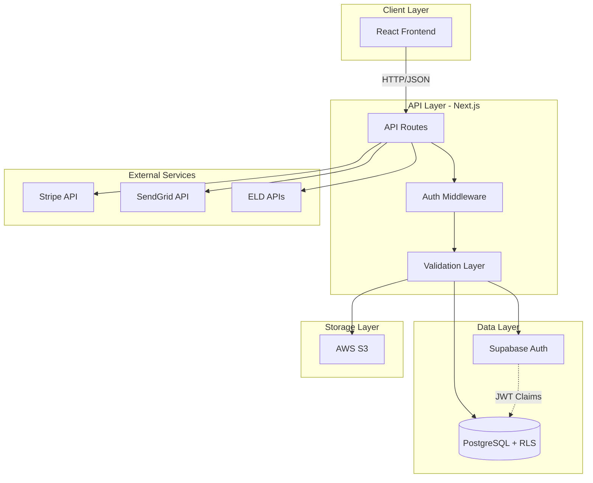

# Design Document: Ghost Apex Operations Portal Backend

## Overview

The Ghost Apex Operations Portal backend is a multi-tenant SaaS platform built on Next.js, PostgreSQL (via Supabase), and AWS S3. The architecture follows a serverless API pattern with Row-Level Security (RLS) enforced at the database layer for tenant isolation. The system integrates with external services (ELD providers, Stripe, SendGrid) and provides RESTful APIs for the existing React frontend.

**Key Design Principles:**
- **Security First**: Multi-tenant isolation via RLS, encrypted storage, secure authentication
- **Scalability**: Serverless architecture, connection pooling, efficient indexing
- **Maintainability**: Clear separation of concerns, modular API design, comprehensive error handling
- **Integration-Ready**: Webhook handlers, API clients for third-party services, extensible data models

**Technology Stack:**
- **Backend Framework**: Next.js 14 (App Router with API routes)
- **Database**: PostgreSQL 15 (via Supabase)
- **Authentication**: Supabase Auth (JWT-based)
- **File Storage**: AWS S3 with server-side encryption
- **Payment Processing**: Stripe API
- **Email Service**: SendGrid API
- **Hosting**: Vercel (frontend + API routes) or Railway (full-stack)

## Architecture

### System Architecture Diagram



### Multi-Tenant Architecture

The system uses a **shared database, shared schema** multi-tenant model with Row-Level Security (RLS) for data isolation:

1. **Tenant Identification**: Each client has a unique `client_id` stored in the `clients` table
2. **User-to-Tenant Mapping**: The `clients` table links `user_id` (from Supabase Auth) to `client_id`
3. **RLS Enforcement**: PostgreSQL RLS policies filter all queries by `client_id` based on JWT claims
4. **Admin Override**: Admin users have a special role that bypasses RLS filters

**Authentication Flow:**
```
1. User logs in → Supabase Auth validates credentials
2. Supabase returns JWT with user_id and role claims
3. Backend queries clients table to get client_id for user_id
4. JWT is enriched with client_id claim (via custom claims or session lookup)
5. All subsequent queries use JWT claims for RLS filtering
```

### API Architecture

The API follows RESTful conventions with the following structure:

```
/api
  /auth
    /login (POST)
    /logout (POST)
    /reset-password (POST)
  /clients
    /me (GET)
    / (GET, POST) [admin only]
    /:id (GET, PATCH, DELETE) [admin only]
  /documents
    / (GET, POST)
    /:id (GET, DELETE)
    /:id/download (GET)
  /tickets
    / (GET, POST)
    /:id (GET, PATCH)
    /:id/messages (GET, POST)
  /reports
    /eld (GET)
    /ifta (GET, POST)
    /driver-files (GET)
    /csa-scores (GET)
    /dataq-disputes (GET, POST)
  /admin
    /dashboard (GET)
    /audit-logs (GET)
    /clients/:id/reports (GET)
  /webhooks
    /stripe (POST)
    /eld-sync (POST)
```

## Components and Interfaces

### 1. Authentication Module

**Purpose**: Handle user authentication, session management, and JWT token generation.

**Components:**
- `AuthService`: Core authentication logic
- `AuthMiddleware`: Validates JWT tokens on protected routes
- `SessionManager`: Manages session lifecycle and refresh tokens

**Interfaces:**

```typescript
interface AuthService {
  login(email: string, password: string): Promise<AuthResponse>
  logout(sessionToken: string): Promise<void>
  resetPassword(email: string): Promise<void>
  verifySession(token: string): Promise<SessionData>
}

interface AuthResponse {
  user: User
  session: Session
  accessToken: string
  refreshToken: string
}

interface SessionData {
  userId: string
  clientId: string | null
  role: 'admin' | 'client'
  email: string
}
```

**Implementation Notes:**
- Use Supabase Auth SDK for authentication
- Store session tokens in httpOnly cookies
- Implement middleware to extract and verify JWT on every protected route
- Add custom claims to JWT for client_id and role

### 2. Database Access Layer

**Purpose**: Provide type-safe database access with RLS enforcement.

**Components:**
- `DatabaseClient`: Supabase client wrapper with connection pooling
- `ClientRepository`: CRUD operations for clients table
- `DocumentRepository`: CRUD operations for documents table
- `TicketRepository`: CRUD operations for support tickets
- `ReportRepository`: CRUD operations for all report tables

**Interfaces:**

```typescript
interface Repository<T> {
  findById(id: string): Promise<T | null>
  findAll(filters?: QueryFilters): Promise<T[]>
  create(data: Partial<T>): Promise<T>
  update(id: string, data: Partial<T>): Promise<T>
  delete(id: string): Promise<void>
}

interface QueryFilters {
  clientId?: string
  status?: string
  dateRange?: { start: Date; end: Date }
  limit?: number
  offset?: number
}
```

**RLS Policy Examples:**

```sql
-- Clients can only see their own data
CREATE POLICY "clients_select_own" ON clients
  FOR SELECT
  USING (auth.uid() = user_id);

-- Admins can see all data
CREATE POLICY "admins_select_all" ON clients
  FOR SELECT
  USING (
    EXISTS (
      SELECT 1 FROM auth.users
      WHERE auth.users.id = auth.uid()
      AND auth.users.raw_user_meta_data->>'role' = 'admin'
    )
  );

-- Documents filtered by client_id
CREATE POLICY "documents_select_own" ON documents
  FOR SELECT
  USING (
    client_id IN (
      SELECT client_id FROM clients WHERE user_id = auth.uid()
    )
  );
```

### 3. Document Storage Module

**Purpose**: Handle file uploads, downloads, and management with S3 integration.

**Components:**
- `S3Client`: AWS S3 SDK wrapper
- `DocumentService`: Business logic for document operations
- `FileValidator`: Validates file types and sizes

**Interfaces:**

```typescript
interface DocumentService {
  uploadDocument(file: File, clientId: string, uploadedBy: string): Promise<Document>
  getDownloadUrl(documentId: string): Promise<string>
  listDocuments(clientId: string, filters?: DocumentFilters): Promise<Document[]>
  deleteDocument(documentId: string): Promise<void>
}

interface Document {
  id: string
  clientId: string
  fileName: string
  fileType: string
  s3Key: string
  s3Bucket: string
  uploadedBy: string
  uploadedAt: Date
  metadata: {
    fileSize: number
    mimeType: string
    checksum?: string
  }
}

interface S3Client {
  uploadFile(key: string, buffer: Buffer, contentType: string): Promise<void>
  getSignedUrl(key: string, expiresIn: number): Promise<string>
  deleteFile(key: string): Promise<void>
}
```

**S3 Key Structure:**
```
{bucket-name}/
  {client_id}/
    documents/
      {timestamp}_{original_filename}
    attachments/
      {ticket_id}/
        {timestamp}_{original_filename}
```

### 4. Support Ticket System

**Purpose**: Manage support tickets with threaded messaging and file attachments.

**Components:**
- `TicketService`: Business logic for ticket operations
- `MessageService`: Handle ticket messages and notifications
- `NotificationService`: Send email notifications

**Interfaces:**

```typescript
interface TicketService {
  createTicket(data: CreateTicketData): Promise<Ticket>
  getTicket(ticketId: string): Promise<TicketWithMessages>
  listTickets(clientId: string, filters?: TicketFilters): Promise<Ticket[]>
  updateTicketStatus(ticketId: string, status: TicketStatus): Promise<Ticket>
  assignTicket(ticketId: string, adminId: string): Promise<Ticket>
}

interface MessageService {
  addMessage(ticketId: string, senderId: string, senderType: 'admin' | 'client', message: string, attachment?: File): Promise<TicketMessage>
  getMessages(ticketId: string): Promise<TicketMessage[]>
}

interface Ticket {
  id: string
  clientId: string
  subject: string
  message: string
  status: 'Open' | 'In Progress' | 'Resolved' | 'Closed'
  priority: 'Low' | 'Medium' | 'High' | 'Urgent'
  assignedTo: string | null
  createdAt: Date
  updatedAt: Date
  resolvedAt: Date | null
}

interface TicketMessage {
  id: string
  ticketId: string
  senderId: string
  senderType: 'admin' | 'client'
  message: string
  attachmentS3Key: string | null
  createdAt: Date
}
```

### 5. ELD Integration Module

**Purpose**: Integrate with ELD provider APIs to sync HOS data and detect violations.

**Components:**
- `ELDClient`: Abstract interface for ELD providers
- `SamsaraClient`: Samsara API implementation
- `MotiveClient`: Motive API implementation
- `ViolationDetector`: Analyzes HOS data for violations
- `ELDSyncService`: Orchestrates data sync and violation detection

**Interfaces:**

```typescript
interface ELDClient {
  getDrivers(clientApiKey: string): Promise<Driver[]>
  getHOSLogs(clientApiKey: string, driverId: string, startDate: Date, endDate: Date): Promise<HOSLog[]>
  getViolations(clientApiKey: string, startDate: Date, endDate: Date): Promise<Violation[]>
}

interface HOSLog {
  driverId: string
  driverName: string
  date: Date
  drivingTime: number
  onDutyTime: number
  offDutyTime: number
  sleeperBerthTime: number
  violations: string[]
}

interface Violation {
  driverId: string
  driverName: string
  violationType: 'driving_over_11' | 'on_duty_over_14' | 'missing_log' | 'form_manner'
  violationDate: Date
  description: string
}

interface ELDSyncService {
  syncClient(clientId: string): Promise<SyncResult>
  detectViolations(hosLogs: HOSLog[]): Violation[]
  createELDReport(clientId: string, weekStart: Date, violations: Violation[]): Promise<ELDReport>
}
```

**Violation Detection Rules:**
- Driving over 11 hours: `drivingTime > 11 * 60`
- On-duty over 14 hours: `onDutyTime > 14 * 60`
- Missing logs: Gaps in daily logs > 24 hours
- Form and manner: Logs edited after 24 hours

### 6. IFTA Calculation Engine

**Purpose**: Calculate IFTA tax obligations from ELD trip data.

**Components:**
- `IFTACalculator`: Core calculation logic
- `TaxRateService`: Manages jurisdiction tax rates
- `IFTAReportGenerator`: Generates PDF reports

**Interfaces:**

```typescript
interface IFTACalculator {
  calculateQuarter(clientId: string, quarter: number, year: number): Promise<IFTARecord>
  aggregateMilesByJurisdiction(trips: Trip[]): Map<string, number>
  aggregateFuelByJurisdiction(fuelPurchases: FuelPurchase[]): Map<string, number>
  calculateTaxOwed(milesByJurisdiction: Map<string, number>, fuelByJurisdiction: Map<string, number>): Map<string, number>
}

interface IFTARecord {
  id: string
  clientId: string
  quarter: number
  year: number
  totalMiles: number
  taxableMiles: number
  fuelGallons: number
  taxOwed: number
  jurisdictionBreakdown: JurisdictionData[]
  status: 'Draft' | 'Approved' | 'Filed'
  createdAt: Date
}

interface JurisdictionData {
  jurisdiction: string
  miles: number
  fuelGallons: number
  taxRate: number
  taxOwed: number
}

interface TaxRateService {
  getTaxRate(jurisdiction: string, effectiveDate: Date): Promise<number>
  updateTaxRate(jurisdiction: string, rate: number, effectiveDate: Date): Promise<void>
}
```

**IFTA Calculation Formula:**
```
For each jurisdiction:
  1. Total miles driven in jurisdiction (from ELD GPS data)
  2. Total fuel purchased in jurisdiction (from fuel receipts)
  3. Fleet MPG = Total miles / Total fuel gallons
  4. Taxable gallons = (Miles in jurisdiction / Fleet MPG) - Fuel purchased in jurisdiction
  5. Tax owed = Taxable gallons × Jurisdiction tax rate
```

### 7. Stripe Integration Module

**Purpose**: Handle subscription billing and payment processing.

**Components:**
- `StripeClient`: Stripe API wrapper
- `SubscriptionService`: Manage subscriptions and billing
- `WebhookHandler`: Process Stripe webhook events

**Interfaces:**

```typescript
interface SubscriptionService {
  createCustomer(email: string, clientId: string): Promise<string>
  createSubscription(customerId: string, priceId: string): Promise<Subscription>
  updateSubscription(subscriptionId: string, newPriceId: string): Promise<Subscription>
  cancelSubscription(subscriptionId: string): Promise<void>
  getBillingHistory(customerId: string): Promise<Invoice[]>
}

interface WebhookHandler {
  handleInvoicePaymentSucceeded(event: StripeEvent): Promise<void>
  handleInvoicePaymentFailed(event: StripeEvent): Promise<void>
  handleSubscriptionDeleted(event: StripeEvent): Promise<void>
  verifyWebhookSignature(payload: string, signature: string): boolean
}

interface Subscription {
  id: string
  customerId: string
  priceId: string
  status: 'active' | 'past_due' | 'canceled' | 'incomplete'
  currentPeriodStart: Date
  currentPeriodEnd: Date
}
```

**Stripe Price IDs (configured in Stripe Dashboard):**
- Wingman: `price_wingman_monthly`
- Guardian: `price_guardian_monthly`
- Apex Command: `price_apex_command_monthly`
- Virtual Dispatcher: `price_virtual_dispatcher_monthly`
- DOT Readiness Audit: `price_dot_audit_monthly`
- Back Office Command: `price_back_office_monthly`

### 8. Email Notification Module

**Purpose**: Send transactional emails for system events.

**Components:**
- `EmailService`: SendGrid API wrapper
- `TemplateRenderer`: Render email templates with data
- `NotificationQueue`: Queue emails for async sending

**Interfaces:**

```typescript
interface EmailService {
  sendEmail(to: string, subject: string, htmlContent: string): Promise<void>
  sendTemplateEmail(to: string, templateId: string, templateData: object): Promise<void>
}

interface EmailTemplate {
  id: string
  name: string
  subject: string
  htmlTemplate: string
  textTemplate: string
}
```

**Email Templates:**
- `client_invitation`: New client signup invitation
- `ticket_created`: Support ticket created notification
- `ticket_message`: New message on support ticket
- `eld_violations`: ELD violations detected
- `password_reset`: Password reset link
- `tier_upgraded`: Service tier upgrade confirmation
- `payment_failed`: Subscription payment failed

### 9. Admin Dashboard Module

**Purpose**: Provide admin-specific functionality and KPI metrics.

**Components:**
- `DashboardService`: Aggregate KPI data
- `AuditLogService`: Track and query admin actions
- `BulkOperationService`: Handle bulk document uploads and assignments

**Interfaces:**

```typescript
interface DashboardService {
  getKPIs(): Promise<DashboardKPIs>
  getRecentActivity(): Promise<ActivityItem[]>
  getClientMetrics(): Promise<ClientMetrics>
}

interface DashboardKPIs {
  totalActiveClients: number
  totalOpenTickets: number
  violationsThisWeek: number
  revenueByTier: Map<string, number>
  newClientsThisMonth: number
  averageTicketResolutionTime: number
}

interface AuditLogService {
  logAction(adminId: string, actionType: string, targetTable: string, targetId: string, changes: object, ipAddress: string): Promise<void>
  queryLogs(filters: AuditLogFilters): Promise<AuditLog[]>
}

interface AuditLog {
  id: string
  adminId: string
  actionType: string
  targetTable: string
  targetId: string
  changes: object
  ipAddress: string
  timestamp: Date
}
```

### 10. Service Tier Access Control

**Purpose**: Enforce feature access based on client subscription tier.

**Components:**
- `TierService`: Validate tier access for features
- `FeatureGate`: Middleware to check tier permissions

**Interfaces:**

```typescript
interface TierService {
  hasFeatureAccess(tier: string, feature: string): boolean
  getAvailableFeatures(tier: string): string[]
  validateTierAccess(clientId: string, feature: string): Promise<boolean>
}

interface FeatureGate {
  requireFeature(feature: string): Middleware
}
```

**Feature Matrix:**
```typescript
const TIER_FEATURES = {
  wingman: ['support_tickets', 'eld_reports', 'dispatch_board'],
  guardian: ['support_tickets', 'eld_reports', 'dispatch_board', 'ifta_reports', 'driver_files'],
  apex_command: ['support_tickets', 'eld_reports', 'dispatch_board', 'ifta_reports', 'driver_files', 'csa_scores', 'dataq_disputes'],
  virtual_dispatcher: ['support_tickets', 'eld_reports', 'ifta_reports', 'driver_files', 'dispatch_board', 'load_schedules', 'broker_packets', 'revenue_reports'],
  dot_readiness_audit: ['dot_audits'],
  back_office_command: ['*'] // All features
}
```

## Data Models

### Database Schema

**users** (managed by Supabase Auth)
```sql
CREATE TABLE auth.users (
  id UUID PRIMARY KEY DEFAULT uuid_generate_v4(),
  email TEXT UNIQUE NOT NULL,
  encrypted_password TEXT NOT NULL,
  email_confirmed_at TIMESTAMPTZ,
  raw_user_meta_data JSONB,
  created_at TIMESTAMPTZ DEFAULT NOW(),
  updated_at TIMESTAMPTZ DEFAULT NOW()
);
```

**clients**
```sql
CREATE TABLE clients (
  id UUID PRIMARY KEY DEFAULT uuid_generate_v4(),
  user_id UUID REFERENCES auth.users(id) ON DELETE CASCADE,
  email TEXT UNIQUE NOT NULL,
  company_name TEXT,
  client_id TEXT UNIQUE NOT NULL,
  tier TEXT NOT NULL CHECK (tier IN ('wingman', 'guardian', 'apex_command', 'virtual_dispatcher', 'dot_readiness_audit', 'back_office_command')),
  status TEXT NOT NULL DEFAULT 'Active' CHECK (status IN ('Active', 'Inactive', 'Payment Failed', 'Canceled')),
  stripe_customer_id TEXT,
  stripe_subscription_id TEXT,
  eld_provider TEXT CHECK (eld_provider IN ('samsara', 'motive')),
  eld_api_key TEXT,
  created_at TIMESTAMPTZ DEFAULT NOW(),
  updated_at TIMESTAMPTZ DEFAULT NOW()
);

CREATE INDEX idx_clients_user_id ON clients(user_id);
CREATE INDEX idx_clients_client_id ON clients(client_id);
CREATE INDEX idx_clients_email ON clients(email);
```

**documents**
```sql
CREATE TABLE documents (
  id UUID PRIMARY KEY DEFAULT uuid_generate_v4(),
  client_id UUID REFERENCES clients(id) ON DELETE CASCADE,
  file_name TEXT NOT NULL,
  file_type TEXT NOT NULL,
  s3_key TEXT NOT NULL,
  s3_bucket TEXT NOT NULL,
  uploaded_by UUID REFERENCES auth.users(id),
  uploaded_at TIMESTAMPTZ DEFAULT NOW(),
  metadata JSONB DEFAULT '{}'::jsonb
);

CREATE INDEX idx_documents_client_id ON documents(client_id);
CREATE INDEX idx_documents_uploaded_at ON documents(uploaded_at);
```

**support_tickets**
```sql
CREATE TABLE support_tickets (
  id UUID PRIMARY KEY DEFAULT uuid_generate_v4(),
  client_id UUID REFERENCES clients(id) ON DELETE CASCADE,
  subject TEXT NOT NULL,
  message TEXT NOT NULL,
  status TEXT NOT NULL DEFAULT 'Open' CHECK (status IN ('Open', 'In Progress', 'Resolved', 'Closed')),
  priority TEXT NOT NULL DEFAULT 'Medium' CHECK (priority IN ('Low', 'Medium', 'High', 'Urgent')),
  assigned_to UUID REFERENCES auth.users(id),
  created_at TIMESTAMPTZ DEFAULT NOW(),
  updated_at TIMESTAMPTZ DEFAULT NOW(),
  resolved_at TIMESTAMPTZ
);

CREATE INDEX idx_support_tickets_client_id ON support_tickets(client_id);
CREATE INDEX idx_support_tickets_status ON support_tickets(status);
CREATE INDEX idx_support_tickets_created_at ON support_tickets(created_at);
```

**ticket_messages**
```sql
CREATE TABLE ticket_messages (
  id UUID PRIMARY KEY DEFAULT uuid_generate_v4(),
  ticket_id UUID REFERENCES support_tickets(id) ON DELETE CASCADE,
  sender_id UUID REFERENCES auth.users(id),
  sender_type TEXT NOT NULL CHECK (sender_type IN ('admin', 'client')),
  message TEXT NOT NULL,
  attachment_s3_key TEXT,
  created_at TIMESTAMPTZ DEFAULT NOW()
);

CREATE INDEX idx_ticket_messages_ticket_id ON ticket_messages(ticket_id);
CREATE INDEX idx_ticket_messages_created_at ON ticket_messages(created_at);
```

**eld_reports**
```sql
CREATE TABLE eld_reports (
  id UUID PRIMARY KEY DEFAULT uuid_generate_v4(),
  client_id UUID REFERENCES clients(id) ON DELETE CASCADE,
  week_start DATE NOT NULL,
  violations INTEGER DEFAULT 0,
  violation_data JSONB DEFAULT '[]'::jsonb,
  corrective_actions TEXT,
  report_notes TEXT,
  created_at TIMESTAMPTZ DEFAULT NOW()
);

CREATE INDEX idx_eld_reports_client_id ON eld_reports(client_id);
CREATE INDEX idx_eld_reports_week_start ON eld_reports(week_start);
```

**ifta_records**
```sql
CREATE TABLE ifta_records (
  id UUID PRIMARY KEY DEFAULT uuid_generate_v4(),
  client_id UUID REFERENCES clients(id) ON DELETE CASCADE,
  quarter INTEGER NOT NULL CHECK (quarter BETWEEN 1 AND 4),
  year INTEGER NOT NULL,
  total_miles NUMERIC(10, 2) NOT NULL,
  taxable_miles NUMERIC(10, 2) NOT NULL,
  fuel_gallons NUMERIC(10, 2) NOT NULL,
  tax_owed NUMERIC(10, 2) NOT NULL,
  jurisdiction_breakdown JSONB DEFAULT '[]'::jsonb,
  status TEXT NOT NULL DEFAULT 'Draft' CHECK (status IN ('Draft', 'Approved', 'Filed')),
  created_at TIMESTAMPTZ DEFAULT NOW(),
  UNIQUE(client_id, quarter, year)
);

CREATE INDEX idx_ifta_records_client_id ON ifta_records(client_id);
CREATE INDEX idx_ifta_records_year_quarter ON ifta_records(year, quarter);
```

**driver_files**
```sql
CREATE TABLE driver_files (
  id UUID PRIMARY KEY DEFAULT uuid_generate_v4(),
  client_id UUID REFERENCES clients(id) ON DELETE CASCADE,
  driver_name TEXT NOT NULL,
  license_number TEXT NOT NULL,
  expiration_date DATE,
  file_type TEXT NOT NULL CHECK (file_type IN ('license', 'medical_card', 'application', 'mvr', 'clearinghouse')),
  s3_key TEXT NOT NULL,
  created_at TIMESTAMPTZ DEFAULT NOW()
);

CREATE INDEX idx_driver_files_client_id ON driver_files(client_id);
CREATE INDEX idx_driver_files_expiration_date ON driver_files(expiration_date);
```

**csa_scores**
```sql
CREATE TABLE csa_scores (
  id UUID PRIMARY KEY DEFAULT uuid_generate_v4(),
  client_id UUID REFERENCES clients(id) ON DELETE CASCADE,
  score_date DATE NOT NULL,
  unsafe_driving NUMERIC(5, 2),
  hos_compliance NUMERIC(5, 2),
  vehicle_maintenance NUMERIC(5, 2),
  controlled_substances NUMERIC(5, 2),
  driver_fitness NUMERIC(5, 2),
  created_at TIMESTAMPTZ DEFAULT NOW()
);

CREATE INDEX idx_csa_scores_client_id ON csa_scores(client_id);
CREATE INDEX idx_csa_scores_score_date ON csa_scores(score_date);
```

**dataq_disputes**
```sql
CREATE TABLE dataq_disputes (
  id UUID PRIMARY KEY DEFAULT uuid_generate_v4(),
  client_id UUID REFERENCES clients(id) ON DELETE CASCADE,
  violation_date DATE NOT NULL,
  dispute_reason TEXT NOT NULL,
  status TEXT NOT NULL DEFAULT 'Pending' CHECK (status IN ('Pending', 'Submitted', 'Under Review', 'Approved', 'Denied')),
  submitted_at TIMESTAMPTZ,
  resolved_at TIMESTAMPTZ,
  outcome TEXT,
  created_at TIMESTAMPTZ DEFAULT NOW()
);

CREATE INDEX idx_dataq_disputes_client_id ON dataq_disputes(client_id);
CREATE INDEX idx_dataq_disputes_status ON dataq_disputes(status);
```

**load_schedules**
```sql
CREATE TABLE load_schedules (
  id UUID PRIMARY KEY DEFAULT uuid_generate_v4(),
  client_id UUID REFERENCES clients(id) ON DELETE CASCADE,
  load_number TEXT NOT NULL,
  pickup_date TIMESTAMPTZ NOT NULL,
  pickup_location TEXT NOT NULL,
  delivery_date TIMESTAMPTZ NOT NULL,
  delivery_location TEXT NOT NULL,
  driver_assigned TEXT,
  status TEXT NOT NULL DEFAULT 'Scheduled' CHECK (status IN ('Scheduled', 'In Transit', 'Delivered', 'Canceled')),
  created_at TIMESTAMPTZ DEFAULT NOW()
);

CREATE INDEX idx_load_schedules_client_id ON load_schedules(client_id);
CREATE INDEX idx_load_schedules_pickup_date ON load_schedules(pickup_date);
```

**broker_packets**
```sql
CREATE TABLE broker_packets (
  id UUID PRIMARY KEY DEFAULT uuid_generate_v4(),
  client_id UUID REFERENCES clients(id) ON DELETE CASCADE,
  broker_name TEXT NOT NULL,
  rate_confirmation_s3_key TEXT,
  bol_s3_key TEXT,
  uploaded_at TIMESTAMPTZ DEFAULT NOW(),
  status TEXT NOT NULL DEFAULT 'Pending' CHECK (status IN ('Pending', 'Approved', 'Rejected'))
);

CREATE INDEX idx_broker_packets_client_id ON broker_packets(client_id);
CREATE INDEX idx_broker_packets_uploaded_at ON broker_packets(uploaded_at);
```

**weekly_revenue_reports**
```sql
CREATE TABLE weekly_revenue_reports (
  id UUID PRIMARY KEY DEFAULT uuid_generate_v4(),
  client_id UUID REFERENCES clients(id) ON DELETE CASCADE,
  week_start DATE NOT NULL,
  week_end DATE NOT NULL,
  total_revenue NUMERIC(10, 2) NOT NULL,
  total_miles NUMERIC(10, 2) NOT NULL,
  revenue_per_mile NUMERIC(5, 2) NOT NULL,
  created_at TIMESTAMPTZ DEFAULT NOW(),
  UNIQUE(client_id, week_start)
);

CREATE INDEX idx_weekly_revenue_reports_client_id ON weekly_revenue_reports(client_id);
CREATE INDEX idx_weekly_revenue_reports_week_start ON weekly_revenue_reports(week_start);
```

**dot_audits**
```sql
CREATE TABLE dot_audits (
  id UUID PRIMARY KEY DEFAULT uuid_generate_v4(),
  client_id UUID REFERENCES clients(id) ON DELETE CASCADE,
  audit_date DATE NOT NULL,
  audit_type TEXT NOT NULL CHECK (audit_type IN ('Compliance Review', 'New Entrant Audit', 'Focused Audit')),
  findings JSONB DEFAULT '[]'::jsonb,
  recommendations TEXT,
  status TEXT NOT NULL DEFAULT 'In Progress' CHECK (status IN ('Scheduled', 'In Progress', 'Completed')),
  created_at TIMESTAMPTZ DEFAULT NOW()
);

CREATE INDEX idx_dot_audits_client_id ON dot_audits(client_id);
CREATE INDEX idx_dot_audits_audit_date ON dot_audits(audit_date);
```

**audit_logs**
```sql
CREATE TABLE audit_logs (
  id UUID PRIMARY KEY DEFAULT uuid_generate_v4(),
  admin_id UUID REFERENCES auth.users(id),
  action_type TEXT NOT NULL,
  target_table TEXT NOT NULL,
  target_id UUID,
  changes JSONB DEFAULT '{}'::jsonb,
  ip_address TEXT,
  timestamp TIMESTAMPTZ DEFAULT NOW()
);

CREATE INDEX idx_audit_logs_admin_id ON audit_logs(admin_id);
CREATE INDEX idx_audit_logs_timestamp ON audit_logs(timestamp);
CREATE INDEX idx_audit_logs_action_type ON audit_logs(action_type);

-- Prevent deletion of audit logs
REVOKE DELETE ON audit_logs FROM PUBLIC;
```

**ifta_tax_rates** (configuration table)
```sql
CREATE TABLE ifta_tax_rates (
  id UUID PRIMARY KEY DEFAULT uuid_generate_v4(),
  jurisdiction TEXT NOT NULL,
  tax_rate NUMERIC(5, 4) NOT NULL,
  effective_date DATE NOT NULL,
  created_at TIMESTAMPTZ DEFAULT NOW(),
  UNIQUE(jurisdiction, effective_date)
);

CREATE INDEX idx_ifta_tax_rates_jurisdiction ON ifta_tax_rates(jurisdiction);
```

## Correctness Properties

*A property is a characteristic or behavior that should hold true across all valid executions of a system—essentially, a formal statement about what the system should do. Properties serve as the bridge between human-readable specifications and machine-verifiable correctness guarantees.*

### Property Reflection

After analyzing all acceptance criteria, I identified the following testable properties and eliminated redundancy:

**Redundancy Analysis:**
- Requirements 2.3-2.7 (specific RLS policies) are covered by the general RLS filtering property (2.1, 2.2)
- Requirement 4.8 (tier validation on endpoints) is covered by 4.7 (403 error for unauthorized access)
- Requirement 5.5 (client document listing) is covered by general RLS property (2.1)
- Requirement 9.12 (general audit logging) is covered by specific audit log properties (10.1-10.5)
- Requirements 14.2 and 14.3 are covered by earlier authentication and authorization properties
- Requirement 14.8 (file type validation) is covered by 5.7

**Combined Properties:**
- Tier-based access control (4.1-4.6) combined into one comprehensive property
- Audit log creation (10.1-10.5) combined into one property
- Dashboard KPI calculations (9.1-9.4) combined into one property
- IFTA aggregations (8.2-8.3) combined into one property

### Properties

**Property 1: Database Unique Constraint Enforcement**

*For any* two client records with the same client_id, attempting to insert the second record should result in a unique constraint violation error.

**Validates: Requirements 1.16**

---

**Property 2: Database Foreign Key Enforcement**

*For any* record insertion that references a non-existent foreign key (e.g., client_id, user_id), the database should reject the insertion with a foreign key constraint error.

**Validates: Requirements 1.17**

---

**Property 3: Multi-Tenant Data Isolation (Client Access)**

*For any* client user and any table containing client_id, querying that table should return only rows where client_id matches the authenticated user's client_id.

**Validates: Requirements 2.1**

---

**Property 4: Admin Full Access**

*For any* admin user and any table, querying that table should return all rows without client_id filtering.

**Validates: Requirements 2.2**

---

**Property 5: Unauthenticated Access Denial**

*For any* API endpoint requiring authentication, requests without a valid session token should return a 401 Unauthorized error.

**Validates: Requirements 2.9**

---

**Property 6: Invalid Credentials Error Handling**

*For any* login attempt with invalid credentials (wrong email or wrong password), the system should return a generic authentication error without revealing which credential was incorrect.

**Validates: Requirements 3.2**

---

**Property 7: Password Complexity Enforcement**

*For any* password that does not meet complexity requirements (minimum 8 characters, at least one uppercase, one lowercase, one number), the system should reject the password with a validation error.

**Validates: Requirements 3.10**

---

**Property 8: Tier-Based Feature Access Control**

*For any* client with a specific tier and any feature, the system should grant access if and only if the feature is included in that tier's feature set.

**Validates: Requirements 4.1, 4.2, 4.3, 4.4, 4.5, 4.6**

---

**Property 9: Unauthorized Feature Access Denial**

*For any* client attempting to access a feature not included in their tier, the system should return a 403 Forbidden error with a message indicating tier upgrade is required.

**Validates: Requirements 4.7**

---

**Property 10: Immediate Tier Update Effect**

*For any* client whose tier is updated by an admin, immediately querying feature access should reflect the new tier's permissions.

**Validates: Requirements 4.9**

---

**Property 11: Document Upload Creates S3 Object and Database Record**

*For any* valid document upload by a client, the system should create both an encrypted S3 object and a corresponding database record in the documents table.

**Validates: Requirements 5.1, 5.3**

---

**Property 12: S3 Key Format Consistency**

*For any* uploaded document, the generated S3 key should match the pattern `{client_id}/{timestamp}_{original_filename}`.

**Validates: Requirements 5.2**

---

**Property 13: Admin Document Upload Association**

*For any* document uploaded by an admin for a specific client, the document record should have the client_id set to the specified client.

**Validates: Requirements 5.6**

---

**Property 14: Document Type Validation**

*For any* document upload, the system should accept only files with extensions: PDF, DOCX, XLSX, PNG, JPG, CSV, and reject all other file types with a validation error.

**Validates: Requirements 5.7**

---

**Property 15: Document Deletion Removes Both Database and S3**

*For any* document deletion by a client, the system should remove both the database record and the S3 object.

**Validates: Requirements 5.9**

---

**Property 16: Document Metadata Storage**

*For any* uploaded document, the system should store metadata (file size, mime type, uploader) in the documents table metadata JSONB field.

**Validates: Requirements 5.10**

---

**Property 17: Support Ticket Creation with Open Status**

*For any* support ticket created by a client, the system should create a record in the support_tickets table with status set to "Open".

**Validates: Requirements 6.1**

---

**Property 18: Ticket Message Creation**

*For any* message added to a support ticket by a client or admin, the system should create a record in the ticket_messages table with the correct sender information.

**Validates: Requirements 6.3**

---

**Property 19: Ticket Messages Chronological Ordering**

*For any* support ticket with multiple messages, retrieving the ticket should return messages sorted by created_at in ascending order.

**Validates: Requirements 6.5**

---

**Property 20: Ticket Assignment Updates Field**

*For any* support ticket assigned by an admin to themselves or another admin, the system should update the assigned_to field with the admin's user_id.

**Validates: Requirements 6.7**

---

**Property 21: Ticket Resolution Updates Status and Timestamp**

*For any* support ticket resolved by an admin, the system should update both the status to "Resolved" and set the resolved_at timestamp.

**Validates: Requirements 6.8**

---

**Property 22: Ticket Message Attachment Storage**

*For any* ticket message with a file attachment, the system should store the file in S3 and record the s3_key in the ticket_messages table.

**Validates: Requirements 6.9**

---

**Property 23: Ticket Reopening on New Message**

*For any* resolved support ticket, adding a new message should change the status back to "Open".

**Validates: Requirements 6.10**

---

**Property 24: HOS Violation Detection**

*For any* HOS log data where driving time exceeds 11 hours or on-duty time exceeds 14 hours, the system should identify and flag the violation.

**Validates: Requirements 7.2**

---

**Property 25: Violation Data Storage**

*For any* detected violations, the system should store violation details in the eld_reports table violation_data JSONB field.

**Validates: Requirements 7.3**

---

**Property 26: ELD Sync Retry Logic**

*For any* ELD data sync that fails, the system should retry up to 3 times with exponential backoff before giving up.

**Validates: Requirements 7.7**

---

**Property 27: ELD Report Completeness**

*For any* ELD report viewed by a client, the system should display violation count, violation details, and corrective actions fields.

**Validates: Requirements 7.9**

---

**Property 28: IFTA Jurisdiction Aggregation**

*For any* quarter's trip data and fuel purchases, the IFTA calculator should correctly aggregate total miles and fuel gallons by jurisdiction.

**Validates: Requirements 8.2, 8.3**

---

**Property 29: IFTA Tax Calculation Accuracy**

*For any* jurisdiction with miles driven and fuel purchased, the system should calculate tax owed using the formula: `(miles / fleet_mpg - fuel_purchased) × tax_rate`.

**Validates: Requirements 8.4**

---

**Property 30: IFTA Record Creation with Draft Status**

*For any* completed IFTA calculation, the system should create a record in the ifta_records table with status set to "Draft".

**Validates: Requirements 8.5**

---

**Property 31: IFTA Approval Status Update**

*For any* IFTA record approved by a client, the system should update the status from "Draft" to "Approved".

**Validates: Requirements 8.6**

---

**Property 32: IFTA Incomplete Data Flagging**

*For any* IFTA calculation with missing or incomplete data (e.g., no trip data for a jurisdiction), the system should flag the record and notify the client.

**Validates: Requirements 8.9**

---

**Property 33: Dashboard KPI Accuracy**

*For any* admin dashboard query, the system should calculate KPIs (total active clients, open tickets, violations this week, revenue by tier) accurately from the database.

**Validates: Requirements 9.1, 9.2, 9.3, 9.4**

---

**Property 34: Client Creation Creates Both User and Client Records**

*For any* new client created by an admin, the system should create records in both the auth.users table and the clients table with proper linkage.

**Validates: Requirements 9.5**

---

**Property 35: Client Tier Update**

*For any* client tier update by an admin, the system should update the tier field in the clients table.

**Validates: Requirements 9.7**

---

**Property 36: Audit Log Creation on Admin Actions**

*For any* admin action (client creation, tier update, document deletion, ticket assignment), the system should create an audit log entry with action_type, target details, and changes.

**Validates: Requirements 9.8, 10.1, 10.2, 10.3, 10.4, 10.5**

---

**Property 37: Client Deactivation Updates Status and Revokes Access**

*For any* client deactivated by an admin, the system should update the status to "Inactive" and subsequent authentication attempts should fail.

**Validates: Requirements 9.9**

---

**Property 38: Client Profile Data Completeness**

*For any* client profile viewed by an admin, the system should return all associated data including documents, tickets, and reports.

**Validates: Requirements 9.10**

---

**Property 39: Audit Log Completeness**

*For any* audit log entry, the system should store admin user_id, IP address, timestamp, action_type, target_table, target_id, and changes.

**Validates: Requirements 10.6**

---

**Property 40: Audit Log Deletion Prevention**

*For any* attempt to delete an audit log entry, the database should reject the operation with a permission denied error.

**Validates: Requirements 10.7**

---

**Property 41: Audit Log Reverse Chronological Ordering**

*For any* audit log query, the system should return entries sorted by timestamp in descending order (newest first).

**Validates: Requirements 10.8**

---

**Property 42: Audit Log Filtering**

*For any* audit log query with filters (admin_id, action_type, date range, target_table), the system should return only entries matching all specified filters.

**Validates: Requirements 10.9**

---

**Property 43: Email Retry Logic**

*For any* email that fails to send, the system should log the error and retry up to 3 times before marking as failed.

**Validates: Requirements 11.9**

---

**Property 44: Unsubscribe Link Presence**

*For any* non-critical notification email, the email content should include an unsubscribe link.

**Validates: Requirements 11.10**

---

**Property 45: Stripe Webhook Payment Success Handling**

*For any* Stripe webhook event of type `invoice.payment_succeeded`, the system should update the corresponding client's status to "Active".

**Validates: Requirements 12.3**

---

**Property 46: Stripe Webhook Payment Failure Handling**

*For any* Stripe webhook event of type `invoice.payment_failed`, the system should update the corresponding client's status to "Payment Failed".

**Validates: Requirements 12.4**

---

**Property 47: Stripe Webhook Subscription Cancellation Handling**

*For any* Stripe webhook event of type `customer.subscription.deleted`, the system should update the client's status to "Canceled" and revoke portal access.

**Validates: Requirements 12.5**

---

**Property 48: Stripe Webhook Signature Verification**

*For any* incoming Stripe webhook, the system should verify the webhook signature before processing, and reject webhooks with invalid signatures.

**Validates: Requirements 12.7**

---

**Property 49: Invalid Input Error Response**

*For any* API endpoint receiving invalid input (wrong data type, missing required field, invalid format), the system should return a 400 Bad Request error with validation details.

**Validates: Requirements 14.1**

---

**Property 50: Resource Not Found Error Response**

*For any* API endpoint querying a non-existent resource by ID, the system should return a 404 Not Found error.

**Validates: Requirements 14.4**

---

**Property 51: Email Format Validation**

*For any* email address input, the system should validate it against a standard email regex pattern and reject invalid formats.

**Validates: Requirements 14.6**

---

**Property 52: Client ID Format Validation**

*For any* client_id input, the system should validate it is alphanumeric and between 6-20 characters, rejecting invalid formats.

**Validates: Requirements 14.7**

---

**Property 53: Date Format Validation**

*For any* date input, the system should validate it conforms to ISO 8601 format and reject invalid date strings.

**Validates: Requirements 14.9**

---

**Property 54: SQL Injection Prevention**

*For any* user input used in database queries, the system should sanitize the input to prevent SQL injection attacks (e.g., reject or escape SQL keywords and special characters).

**Validates: Requirements 14.10**

---

**Property 55: Error Logging with Stack Traces**

*For any* error that occurs during request processing, the system should log the error with a complete stack trace to the logging service.

**Validates: Requirements 14.12**

## Error Handling

### Error Response Format

All API errors follow a consistent JSON format:

```typescript
interface ErrorResponse {
  error: {
    code: string
    message: string
    details?: object
    timestamp: string
    requestId: string
  }
}
```

### Error Categories

**1. Authentication Errors (401)**
- `AUTH_INVALID_CREDENTIALS`: Invalid email or password
- `AUTH_SESSION_EXPIRED`: Session token has expired
- `AUTH_TOKEN_MISSING`: No authentication token provided
- `AUTH_TOKEN_INVALID`: Authentication token is malformed or invalid

**2. Authorization Errors (403)**
- `AUTHZ_INSUFFICIENT_PERMISSIONS`: User lacks required permissions
- `AUTHZ_TIER_UPGRADE_REQUIRED`: Feature requires higher service tier
- `AUTHZ_ADMIN_ONLY`: Endpoint requires admin role

**3. Validation Errors (400)**
- `VALIDATION_INVALID_EMAIL`: Email format is invalid
- `VALIDATION_INVALID_CLIENT_ID`: Client ID format is invalid
- `VALIDATION_INVALID_DATE`: Date format is invalid
- `VALIDATION_MISSING_FIELD`: Required field is missing
- `VALIDATION_INVALID_FILE_TYPE`: File type not supported
- `VALIDATION_FILE_TOO_LARGE`: File exceeds size limit

**4. Resource Errors (404)**
- `RESOURCE_NOT_FOUND`: Requested resource does not exist
- `CLIENT_NOT_FOUND`: Client record not found
- `DOCUMENT_NOT_FOUND`: Document not found
- `TICKET_NOT_FOUND`: Support ticket not found

**5. Conflict Errors (409)**
- `CONFLICT_DUPLICATE_CLIENT_ID`: Client ID already exists
- `CONFLICT_DUPLICATE_EMAIL`: Email already registered

**6. External Service Errors (502, 503)**
- `EXTERNAL_S3_ERROR`: AWS S3 operation failed
- `EXTERNAL_STRIPE_ERROR`: Stripe API error
- `EXTERNAL_SENDGRID_ERROR`: SendGrid API error
- `EXTERNAL_ELD_ERROR`: ELD provider API error

**7. Internal Errors (500)**
- `INTERNAL_DATABASE_ERROR`: Database operation failed
- `INTERNAL_UNEXPECTED_ERROR`: Unexpected server error

### Error Handling Strategy

**Retry Logic:**
- External API calls: 3 retries with exponential backoff (1s, 2s, 4s)
- Database operations: 2 retries with 500ms delay
- Email sending: 3 retries with 1s delay

**Graceful Degradation:**
- If S3 is unavailable, queue document uploads for later processing
- If email service is down, log notification and retry asynchronously
- If ELD API is unavailable, skip sync and schedule retry

**Error Logging:**
- All errors logged to centralized logging service (e.g., Sentry, LogRocket)
- Include: error code, message, stack trace, user context, request details
- Critical errors trigger admin notifications

**User-Friendly Messages:**
- Never expose internal error details to users
- Provide actionable guidance (e.g., "Please contact support with request ID: xyz")
- Include support contact information for critical errors

## Testing Strategy

### Dual Testing Approach

The system requires both unit testing and property-based testing for comprehensive coverage:

**Unit Tests:**
- Specific examples demonstrating correct behavior
- Edge cases (empty inputs, boundary values, null handling)
- Error conditions (invalid inputs, missing resources, constraint violations)
- Integration points between components
- Mock external services (S3, Stripe, SendGrid, ELD APIs)

**Property-Based Tests:**
- Universal properties that hold for all inputs
- Comprehensive input coverage through randomization
- Minimum 100 iterations per property test
- Each property test references its design document property

**Testing Balance:**
- Unit tests focus on concrete scenarios and edge cases
- Property tests verify general correctness across all inputs
- Together they provide comprehensive coverage

### Property-Based Testing Configuration

**Library Selection:**
- **JavaScript/TypeScript**: Use `fast-check` library
- **Installation**: `npm install --save-dev fast-check`

**Test Configuration:**
- Minimum 100 iterations per property test (configured via `fc.assert` options)
- Each test tagged with comment referencing design property
- Tag format: `// Feature: ghost-apex-backend, Property {number}: {property_text}`

**Example Property Test:**

```typescript
import fc from 'fast-check'
import { describe, it } from 'vitest'

describe('Multi-Tenant Data Isolation', () => {
  it('should filter data by client_id for client users', () => {
    // Feature: ghost-apex-backend, Property 3: Multi-Tenant Data Isolation (Client Access)
    fc.assert(
      fc.asyncProperty(
        fc.uuid(), // clientId
        fc.array(fc.record({ id: fc.uuid(), client_id: fc.uuid(), data: fc.string() })), // documents
        async (clientId, documents) => {
          // Setup: Insert documents with various client_ids
          await insertDocuments(documents)
          
          // Act: Query as client with specific client_id
          const result = await queryDocumentsAsClient(clientId)
          
          // Assert: All returned documents have matching client_id
          result.every(doc => doc.client_id === clientId)
        }
      ),
      { numRuns: 100 }
    )
  })
})
```

### Unit Testing Strategy

**Test Organization:**
- Group tests by module (auth, documents, tickets, reports, etc.)
- Use descriptive test names following "should [expected behavior] when [condition]" pattern
- Mock external dependencies (database, S3, APIs)

**Coverage Requirements:**
- Minimum 80% code coverage for all modules
- 100% coverage for critical security functions (auth, RLS, validation)
- All error paths must have explicit tests

**Example Unit Test:**

```typescript
import { describe, it, expect, vi } from 'vitest'
import { DocumentService } from './document-service'

describe('DocumentService', () => {
  it('should reject file upload when file type is not allowed', async () => {
    const service = new DocumentService()
    const file = new File(['content'], 'test.exe', { type: 'application/x-msdownload' })
    
    await expect(
      service.uploadDocument(file, 'client-123', 'user-456')
    ).rejects.toThrow('VALIDATION_INVALID_FILE_TYPE')
  })
  
  it('should create both S3 object and database record on successful upload', async () => {
    const s3Mock = vi.fn().mockResolvedValue({ key: 'client-123/123456_test.pdf' })
    const dbMock = vi.fn().mockResolvedValue({ id: 'doc-789' })
    
    const service = new DocumentService(s3Mock, dbMock)
    const file = new File(['content'], 'test.pdf', { type: 'application/pdf' })
    
    const result = await service.uploadDocument(file, 'client-123', 'user-456')
    
    expect(s3Mock).toHaveBeenCalledOnce()
    expect(dbMock).toHaveBeenCalledOnce()
    expect(result.id).toBe('doc-789')
  })
})
```

### Integration Testing

**API Endpoint Tests:**
- Test complete request/response cycle
- Use test database with RLS policies enabled
- Test authentication and authorization flows
- Verify correct HTTP status codes and response formats

**External Service Integration:**
- Use sandbox/test environments for Stripe, SendGrid
- Mock ELD API responses for consistent testing
- Test webhook handling with simulated events

### End-to-End Testing

**Critical User Flows:**
- Client signup and authentication
- Document upload and download
- Support ticket creation and messaging
- ELD report generation
- IFTA calculation and approval
- Admin client management

**Tools:**
- Playwright or Cypress for browser automation
- Test against staging environment with production-like data
